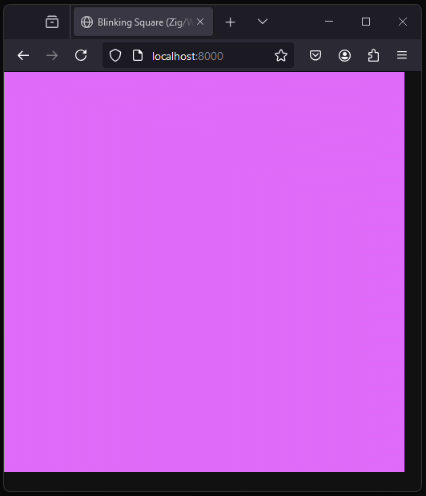
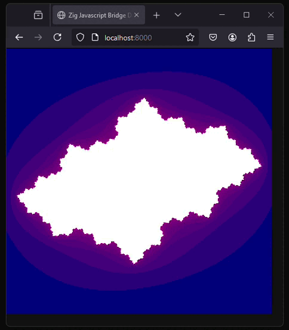

# WebGL examples via Zig/WASM

The programs below illustrate examples of creating WebGL graphics almost entirely in Zig. Thes examples are based on the work of Scott Redig's [zig-javascript-bridge](https://github.com/scottredig/zig-javascript-bridge) repo, which enables javascript functions to be called from Zig without the need to write ANY javascript code to interface with the `.wasm` that the Zig compiler generates. (With Redig's repo, the Zig build process automatically generates the necessary functions in .js that translate the calls.

THIS REPO IS UNDER DEVELOPMENT and the code is for eductional purposes only. *Used verbatim, it is probably unsuitable for production code.*

Note: The actual examples look significantly better than the `.gifs` below... `.gifs` are just approximations! 

## Building the examples

Building things in Zig is almost trivial with a `zig.build` file (and this project has one).

To compile a project, simply run `zig build PROJECT` where `PROJECT` is one of the following: `blinking`, `fractal`.

### Example

To build the fractal example below, first call `zig build fractal`. Files will get created in `zig-out/bin`. Navigate to `zig-out/bin`, and host a web server from there. (E.g, via `python -m http.server`, then open a browser with `localhost:8000`.)

## [Blinking Rectangle](./blinking-screen)

A rectangle oscillates between pink and blue.

## [Julia Sets](./fractal)

A continuous (kinda) series of Julia sets are rendered in a loop.
