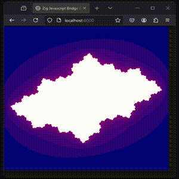

# WebGL examples via Zig/WASM

The programs below illustrate examples of creating WebGL graphics almost entirely in Zig. Thes examples are based on the work of Scott Redig's [zig-javascript-bridge](https://github.com/scottredig/zig-javascript-bridge) repo, which enables javascript functions to be called from Zig without the need to write ANY javascript code to interface with the `.wasm` that the Zig compiler generates. (With Redig's repo, the Zig build process automatically generates the necessary functions in .js that translate the calls.

Note: The actual examples look significantly better than the `.gifs` below... `.gifs` are just approximations! 

## Building the examples

Building things in Zig is almost trivial with a `zig.build` and `zig.build.zon` file (and this project has both):

To compile a project, simply run `zig build <PROJECT> -Doptimize=ReleaseFast` where `<PROJECT>` is one of the following:
- `blinking_screen`
- `looping_fractal`
- `rainbow_triangle`

and `zig` is the Zig `0.13.0` compiler, freely available at: https://ziglang.org/download/

### Example

To build the fractal example below, first call `zig build looping_fractal` -Doptimize=ReleaseFast. Files will get created in `zig-out/looping_fractal`. Navigate to `zig-out/looping_fractal`, and host a web server from there. (E.g, via `python -m http.server`, then open a browser with `localhost:8000`.)

## [Blinking Screen](./blinking_screen)

A rectangle oscillates between pink and blue.

## [Looping Fractal](./looping_fractal)

A continuous (kinda) series of Julia sets are rendered in a loop.

## [Rainbow Triangle](./rainbow_triangle)

A rainbow triangle rotates over time.

